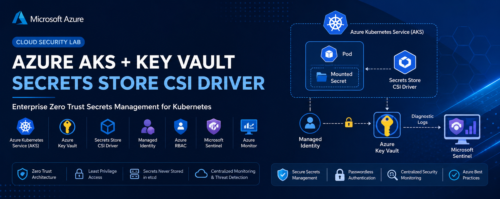
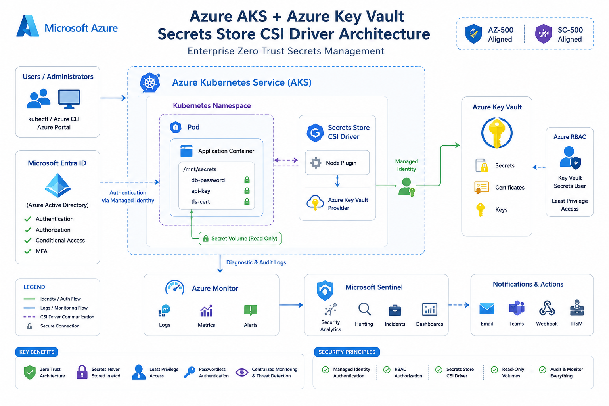

<p align="center">


</p>

<h1 align="center">
🔐 Azure AKS + Azure Key Vault Secrets Store CSI Driver Security Lab
</h1>

<p align="center">
<b>Enterprise Zero Trust Secrets Management using Azure Kubernetes Service, Azure Key Vault, Managed Identity, Azure RBAC, Secrets Store CSI Driver, and Microsoft Sentinel</b>
</p>

<p align="center">

<a href="https://github.com/AmalUBasnayake/azure-aks-key-vault-csi-driver-security-lab/stargazers">

</a>

<a href="https://github.com/AmalUBasnayake/azure-aks-key-vault-csi-driver-security-lab/network/members">

</a>

<a href="https://github.com/AmalUBasnayake">

</a>

<a href="https://www.linkedin.com/in/amal-udayanga-basnayake">

</a>

</p>

---

> Enterprise-grade implementation of **Zero Trust secrets management** in **Azure Kubernetes Service (AKS)** using **Azure Key Vault**, **Secrets Store CSI Driver**, **Managed Identity**, **Azure RBAC**, and **Microsoft Sentinel** for centralized security monitoring.



---

## 🏗️ Solution Architecture



---

# 📖 Project Overview

Modern cloud-native applications require secure, scalable, and passwordless methods for managing sensitive information such as database credentials, API keys, certificates, and connection strings.

This project demonstrates an enterprise security architecture where Azure Kubernetes Service (AKS) securely retrieves secrets directly from Azure Key Vault through the Azure Key Vault Provider for the Secrets Store CSI Driver.

Instead of storing secrets inside Kubernetes etcd, secrets remain protected within Azure Key Vault and are dynamically mounted into running pods using Azure Managed Identity. Additionally, diagnostic logs from AKS and Azure Key Vault are forwarded to Microsoft Sentinel, enabling centralized monitoring, auditing, and security investigations.

This implementation follows Microsoft's Zero Trust architecture principles and aligns with Azure Security best practices covered in **AZ-500: Microsoft Azure Security Engineer Associate** and **SC-500: Microsoft Certified - Cloud and AI Security Engineer Associate**.

---

# 🎯 Project Objectives

- Deploy Azure Kubernetes Service (AKS)
- Configure Azure Key Vault for secure secret storage
- Enable Azure Key Vault Provider for Secrets Store CSI Driver
- Implement passwordless authentication using Managed Identity
- Configure Azure RBAC with least privilege permissions
- Mount Azure Key Vault secrets directly into Kubernetes Pods
- Eliminate Kubernetes Secret storage within etcd
- Forward diagnostic logs to Microsoft Sentinel
- Demonstrate enterprise-grade Zero Trust secret management

---

# 🏗️ Architecture Components

| Component | Purpose |
|------------|---------|
| Azure Kubernetes Service (AKS) | Kubernetes container platform |
| Azure Key Vault | Centralized secrets management |
| Azure Managed Identity | Passwordless authentication |
| Azure RBAC | Least privilege authorization |
| Secrets Store CSI Driver | Runtime secret injection |
| Azure Monitor | Diagnostic log collection |
| Microsoft Sentinel | Security monitoring & incident investigation |

---

# 🔐 Security Workflow

```text
Developer
      │
      ▼
Azure Kubernetes Service (AKS)
      │
Managed Identity Authentication
      │
      ▼
Azure Key Vault
      │
Secrets Store CSI Driver
      │
Mount Secret into Pod
      ▼
Containerized Application
      │
Diagnostic Logs
      ▼
Microsoft Sentinel
```

---

# 🚀 Implementation Steps

## Step 1 — Deploy Azure Key Vault

A dedicated Azure Resource Group and Azure Key Vault were created to securely manage application secrets. A secret named **db-password** was added to simulate production credential management.

### Screenshots


---

## Step 2 — Deploy Azure Kubernetes Service (AKS)

Azure Kubernetes Service was deployed with the Azure Key Vault Secrets Provider add-on enabled, allowing secure integration with Azure Key Vault.

### Screenshots


---

## Step 3 — Configure Azure RBAC

Least privilege permissions were assigned to the AKS Managed Identity using the **Key Vault Secrets User** role.

### Security Principle

- Least Privilege
- Identity-based Authentication
- Azure RBAC Authorization

### Screenshots


---

## Step 4 — Deploy SecretProviderClass

The SecretProviderClass resource was configured to retrieve secrets from Azure Key Vault and expose them securely inside Kubernetes Pods.

### Screenshots


---

## Step 5 — Verify Mounted Secret

The running container successfully retrieved the secret directly from Azure Key Vault through the Secrets Store CSI Driver.

### Screenshot


---

## Step 6 — Configure Monitoring with Microsoft Sentinel

Diagnostic Settings were configured for Azure Key Vault and AKS. Security logs were forwarded to Microsoft Sentinel for centralized monitoring and threat investigation.

### Screenshots


---

# 🛡️ Security Controls Implemented

| Security Control | Implementation |
|------------------|----------------|
| Zero Trust | Passwordless authentication |
| Managed Identity | Secure workload authentication |
| Azure RBAC | Least privilege authorization |
| Azure Key Vault | Secure secrets management |
| Secrets Store CSI Driver | Runtime secret injection |
| Microsoft Sentinel | Centralized monitoring |
| Diagnostic Settings | Security auditing |
| Kubernetes | No secrets stored in etcd |

---

# 🔍 Security Benefits

✅ Passwordless authentication using Azure Managed Identity

✅ Secrets remain protected inside Azure Key Vault

✅ No credentials stored inside Kubernetes Secrets

✅ Read-only secret mounting

✅ Enterprise RBAC implementation

✅ Centralized security visibility using Microsoft Sentinel

✅ Zero Trust architecture

---

# 🚀 Skills Demonstrated

- Microsoft Azure Security
- Azure Kubernetes Service (AKS)
- Azure Key Vault
- Azure Managed Identity
- Azure RBAC
- Secrets Store CSI Driver
- Microsoft Sentinel
- Azure Monitor
- Kubernetes Security
- Cloud Security Engineering
- Zero Trust Architecture

---

# 📚 Key Learning Outcomes

This lab provided practical experience in designing and implementing enterprise-grade Kubernetes secrets management using Microsoft Azure security services.

Key learning outcomes include:

- Designing Zero Trust authentication workflows
- Implementing passwordless authentication
- Configuring Azure RBAC securely
- Integrating Azure Key Vault with AKS
- Managing secrets without Kubernetes Secrets
- Monitoring Azure resources using Microsoft Sentinel
- Applying Azure Security best practices

---

# 🔮 Future Enhancements

- Azure Workload Identity
- Automatic Secret Rotation
- Azure Policy Enforcement
- GitHub Actions CI/CD Integration
- Microsoft Defender for Containers
- Defender for Cloud CSPM Integration
- Multi-cluster Secret Management
- Production-scale Kubernetes Security

---

# 👨‍💻 Author

**Amal Udayanga Basnayake**

Cybersecurity Undergraduate

Cloud Security • Azure Security • Kubernetes Security • DevSecOps • Microsoft Sentinel • AI Security

---

# ⭐ If you found this project useful

Consider giving this repository a ⭐ to support future Azure Security projects.

---
